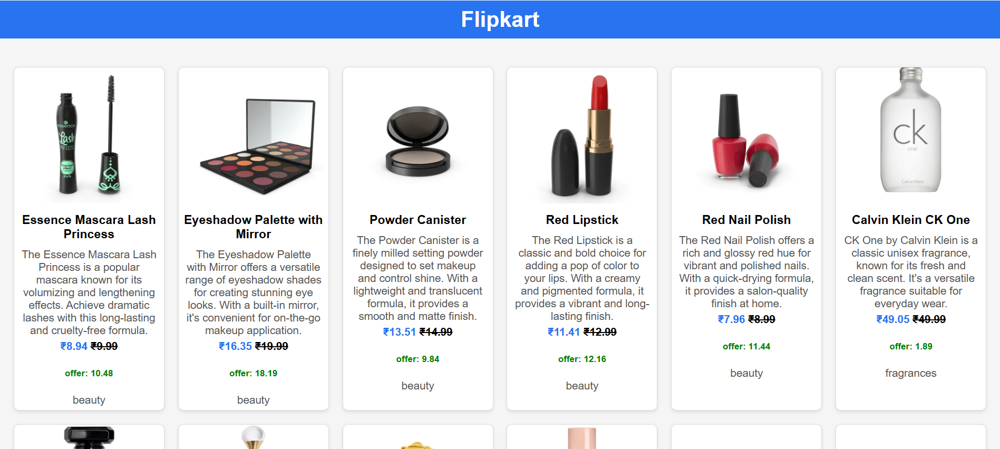

# 🛍️ Flipkart E-Commerce Product Showcase

This project is a **responsive E-Commerce Product Listing page** that fetches product data using **API integration** and dynamically renders JSON data to display products in a clean card layout.

---

## 🚀 Features

✅ **API Integration**: Fetches live product data from `https://dummyjson.com/products` using `XMLHttpRequest`.  
✅ Dynamically **parses JSON** and renders product cards on page load.  
✅ Displays:
- Product Image
- Title and Description
- Original Price (strikethrough) and Discounted Price
- Discount Percentage
- Category

✅ **Responsive Grid Layout** using CSS Grid.  
✅ Clean, card-based UI for easy readability.

---

## 🛠️ Technologies Used

- **HTML**
- **CSS** (Grid, responsive styling)
- **JavaScript**
    - `XMLHttpRequest` for API calls
    - JSON parsing
    - DOM manipulation for rendering data dynamically

---

## 📸 Screenshot

---

## 📂 Project Structure

- `flipkart.html` - Main product listing with integrated API rendering
- `style` (inlined within HTML) for styling
- Uses **DummyJSON API** for live data fetching

---

## ⚙️ How It Works

- On page load, an API call is made to `https://dummyjson.com/products`.
- The JSON response is parsed to extract `products`.
- Each product is displayed as a card with:
    - Image
    - Title
    - Description
    - Original Price and Discounted Price
    - Discount Percentage
    - Category

This project demonstrates **practical API integration, JSON handling, and dynamic rendering**, preparing you for real-world front-end development tasks.

